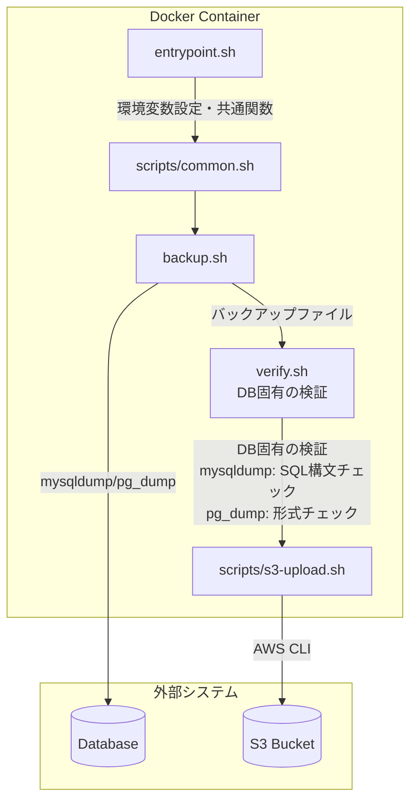

# DB Backup Worker

MariaDB と PostgreSQL のデータベースバックアップを取得し、Amazon S3 に自動的にアップロードする Docker イメージのコレクションです。

## 概要

このプロジェクトでは以下の2つの Docker イメージを提供しています：

- **mariadb-dump-to-s3**: MariaDB データベースのバックアップイメージ
- **pg-dump-to-s3**: PostgreSQL データベースのバックアップイメージ

両イメージは以下の機能を提供します：

- データベースからバックアップを取得
- バックアップの正当性を検証（DB固有の検証ロジック）
- Amazon S3 へのアップロード
- GitHub Actions による CI/CD
- ghcr.io へのデプロイ

## アーキテクチャ



## イメージ一覧

### MariaDB バックアップイメージ
- TBD

詳細: [mariadb-backup/README.md](mariadb-backup/README.md)

### PostgreSQL バックアップイメージ
- TBD

詳細: [postgres-backup/README.md](postgres-backup/README.md)

## クイックスタート

### MariaDB バックアップ

```bash
docker run --rm \
  -e DB_HOST=your-db-host.com \
  -e DB_PORT=3306 \
  -e DB_USER=root \
  -e DB_PASSWORD=your-password \
  -e DB_NAME=mydb \
  -e BACKUP_NAME=daily_backup \
  -e BUCKET_NAME=your-backup-bucket \
  -e BUCKET_DIR=mariadb/ \
  -e AWS_ACCESS_KEY_ID=your-access-key \
  -e AWS_SECRET_ACCESS_KEY=your-secret-key \
  -e AWS_REGION=us-east-1 \
  ghcr.io/<repo>/mariadb-dump-to-s3:v1.2.0-maria11.4
```

### PostgreSQL バックアップ

```bash
docker run --rm \
  -e DB_HOST=your-db-host.com \
  -e DB_PORT=5432 \
  -e DB_USER=postgres \
  -e DB_PASSWORD=your-password \
  -e DB_NAME=mydb \
  -e BACKUP_NAME=daily_backup \
  -e BUCKET_NAME=your-backup-bucket \
  -e BUCKET_DIR=postgres/ \
  -e AWS_ACCESS_KEY_ID=your-access-key \
  -e AWS_SECRET_ACCESS_KEY=your-secret-key \
  -e AWS_REGION=us-east-1 \
  ghcr.io/<repo>/pg-dump-to-s3:v1.2.0-pg16
```

## ディレクトリ構成

```
db-backup-worker/
├── .github/
│   └── workflows/
│       ├── ci-mariadb.yml          # MariaDBイメージのCI
│       ├── ci-postgres.yml         # PostgreSQLイメージのCI
│       └── publish.yml             # ghcr.ioへのデプロイ
├── mariadb-backup/
│   ├── Dockerfile                  # MariaDB用Dockerイメージ
│   ├── docker-compose.test.yml     # ローカルテスト用
│   ├── entrypoint.sh               # エントリーポイント
│   ├── backup.sh                   # バックアップ実行スクリプト
│   ├── verify.sh                   # MariaDB固有のバックアップ検証
│   └── README.md                   # MariaDBイメージのドキュメント
├── postgres-backup/
│   ├── Dockerfile                  # PostgreSQL用Dockerイメージ
│   ├── docker-compose.test.yml     # ローカルテスト用
│   ├── entrypoint.sh               # エントリーポイント
│   ├── backup.sh                   # バックアップ実行スクリプト
│   ├── verify.sh                   # PostgreSQL固有のバックアップ検証
│   └── README.md                   # PostgreSQLイメージのドキュメント
├── scripts/
│   ├── common.sh                   # 共通関数・設定
│   └── s3-upload.sh                # S3アップロード処理
├── .gitignore
└── README.md
```

## CI/CD

このプロジェクトは GitHub Actions を使用して CI/CD を行っています：

- **CI**: プッシュまたはプルリクエスト時に自動的にビルドとテストを実行
- **CD**: タグプッシュ時にイメージを ghcr.io にプッシュ

### 手動リリース

GitHub Actions のワークフローから手動でイメージをビルド・プッシュすることもできます。

1. GitHub Actions ページに移動
2. `Publish to GHCR` ワークフローを選択
3. `Run workflow` をクリック
4. イメージタイプとバージョンを指定して実行

## 開発

### 前提条件

- Docker
- Docker Compose
- Bash

### テスト

MariaDB:

```bash
cd mariadb-backup
docker build -t mariadb-dump-to-s3:test .
docker compose -f docker-compose.test.yml up -d
docker run --rm \
  --network container:test-mariadb \
  -e DB_HOST=localhost \
  -e DB_PORT=3306 \
  -e DB_USER=root \
  -e DB_PASSWORD=testpass \
  -e DB_NAME=testdb \
  -e BACKUP_NAME=test_backup \
  -e SKIP_S3_UPLOAD=true \
  mariadb-dump-to-s3:test
docker compose -f docker-compose.test.yml down -v
```

PostgreSQL:

```bash
cd postgres-backup
docker build -t pg-dump-to-s3:test .
docker compose -f docker-compose.test.yml up -d
docker run --rm \
  --network container:test-postgres \
  -e DB_HOST=localhost \
  -e DB_PORT=5432 \
  -e DB_USER=postgres \
  -e DB_PASSWORD=testpass \
  -e DB_NAME=testdb \
  -e BACKUP_NAME=test_backup \
  -e SKIP_S3_UPLOAD=true \
  pg-dump-to-s3:test
docker compose -f docker-compose.test.yml down -v
```

## 環境変数

### 共通環境変数

| 変数名 | 必須 | デフォルト値 | 説明 |
|--------|------|-------------|------|
| `DB_HOST` | Yes | - | データベースのホスト名 |
| `DB_PORT` | Yes | 3306 (MariaDB) / 5432 (PostgreSQL) | データベースのポート |
| `DB_USER` | Yes | - | データベースのユーザー名 |
| `DB_PASSWORD` | Yes | - | データベースのパスワード |
| `DB_NAME` | Yes | - | バックアップするデータベース名 |
| `BACKUP_NAME` | Yes | - | バックアップファイル名（拡張子なし） |
| `BUCKET_NAME` | Yes* | - | S3 バケット名（`SKIP_S3_UPLOAD=false`時は必須） |
| `BUCKET_DIR` | Yes* | - | S3 オブジェクトのディレクトリ/プレフィックス（`SKIP_S3_UPLOAD=false`時は必須） |
| `AWS_ACCESS_KEY_ID` | No | - | AWS アクセスキー |
| `AWS_SECRET_ACCESS_KEY` | No | - | AWS シークレットキー |
| `AWS_REGION` | No | - | AWS リージョン |
| `BUCKET_URL` | No | - | カスタム S3 エンドポイント URL (MinIOなど) |
| `SKIP_S3_UPLOAD` | No | false | S3 アップロードをスキップするかどうか |

## バックアップ検証

各イメージは S3 にアップロードする前にバックアップを検証します：

### MariaDB バックアップ検証

1. ファイルサイズチェック
2. 署名チェック（MariaDB/MySQL ダンプの確認）

### PostgreSQL バックアップ検証

1. ファイルサイズチェック
2. 署名チェック（PostgreSQL ダンプの確認）
3. SQL ステートメントチェック（`SET` コマンドなどが含まれていることを確認）

## セキュリティ

- データベースのパスワードは環境変数経由で渡します
- AWS 認証情報は環境変数または IAM ロールを使用します
- バックアップファイルは検証後にのみ S3 にアップロードされます

## ライセンス

MIT License
